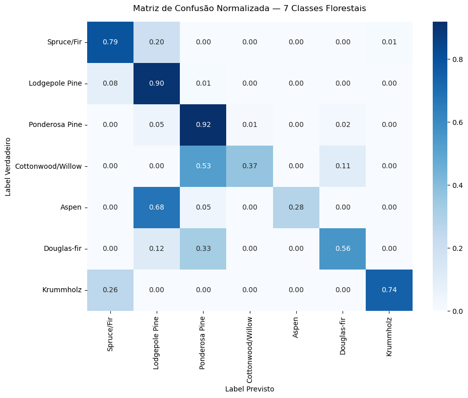
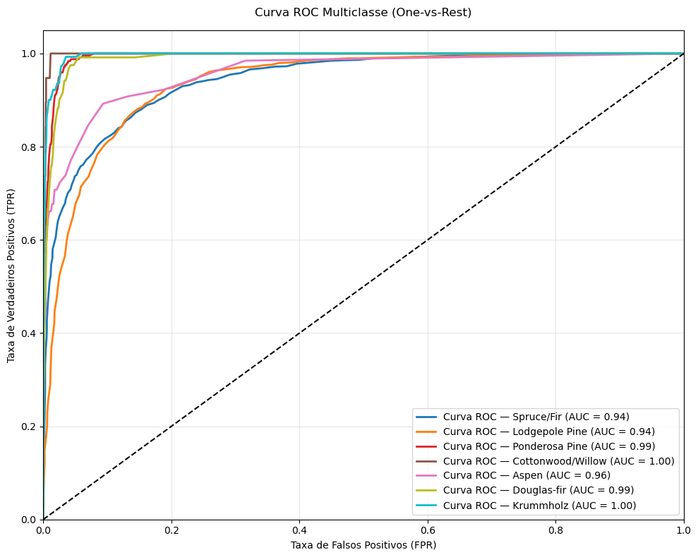

# Pipeline de Engenharia de Métricas para Classificação Multiclasse

Este repositório apresenta o desenvolvimento e a análise diagnóstica de um pipeline modular de Machine Learning para a classificação de coberturas florestais. O projeto foi projetado seguindo princípios de código limpo (Clean Code) e Programação Orientada a Objetos (POO), mitigando abordagens imperativas e lineares comuns em scripts de estudos.

Desafio de Projeto — DIO BairesDev - Machine Learning Practitioner

---

## 1. Descrição do Problema e Dataset

O objetivo do projeto é classificar áreas geográficas em 7 tipos distintos de cobertura florestal com base em variáveis cartográficas e ecológicas (como elevação, orientação, declividade e distância de recursos hídricos).

Para garantir a robustez e simular os desafios de um ambiente de produção real, o pipeline utiliza o **Covtype Dataset** (Forest Covertype), um benchmark clássico de Machine Learning disponível via repositório UCI.

### Desafios de Engenharia de Dados Aplicados:
* **Volatilidade de Processamento:** O dataset original possui 581.012 linhas. Foi aplicada uma engenharia de amostragem utilizando `resample` estratificado para reduzir o volume para 20.000 instâncias, viabilizando o custo de hardware sem comprometer a representatividade estatística.
* **Desbalanceamento Severo:** O conjunto de dados apresenta uma distribuição de classes altamente desigual (onde tipos como *Lodgepole Pine* dominam massivamente o volume, enquanto *Cottonwood/Willow* e *Aspen* são extremamente raros).

---

## 2. Arquitetura da Solução

O pipeline foi estruturado sob o paradigma de Programação Orientada a Objetos (POO) através do encapsulamento da lógica de avaliação na classe `PerformanceEvaluator`.

### Destaques Técnicos da Implementation:
* **Modularidade e Tipagem:** Uso de *Type Hints* nativos (`np.ndarray`, `List[str]`) para garantir integridade e consistência na passagem de dados entre funções.
* **Estratégia One-vs-Rest (OvR):** Binarização de rótulos para possibilitar o cálculo rigoroso das matrizes de Taxa de Verdadeiros Positivos (TPR) e Falsos Positivos (FPR) por classe individual.
* **Tratamento Estocástico:** Isolamento das previsões discretas (`y_pred`) para métricas de matriz, e de distribuições de probabilidade predita (`y_prob` via `predict_proba`) para construção de limiares dinâmicos na curva ROC.

---

## 3. Análise Diagnóstica dos Resultados

Abaixo está a interpretação técnica das ferramentas de diagnóstico geradas pelo modelo `RandomForestClassifier` (100 estimadores) ajustado aos dados.

### 3.1. Matriz de Confusão Normalizada
A fim de neutralizar a distorção visual provocada pelo desbalanceamento numérico das classes florestais, a matriz de confusão foi **normalizada por linha** (exibindo as taxas de acerto e erro em proporções de 0.00 a 1.00).

* **Alto Desempenho Global:** O modelo demonstra forte capacidade preditiva estável, concentrando os maiores gradientes de azul escuro na diagonal principal. Destacam-se as classes `Ponderosa Pine` (92% de acerto) e `Lodgepole Pine` (90% de acerto).
* **Identificação de Conflitos Ecológicos:** A classe `Aspen` obteve apenas 28% de classificação correta, sendo frequentemente confundida com `Lodgepole Pine` (68% de erro). Da mesma forma, `Cottonwood/Willow` foi classificada incorretamente como `Ponderosa Pine` em 53% das vezes. Esse comportamento expõe que variáveis cartográficas brutas possuem regiões de alta sobreposição ecológica entre essas espécies vegetais específicas, delimitando o limite de fronteira linear do algoritmo.

### 3.2. Curva ROC Multiclasse (One-vs-Rest)
A análise estocástica confirma a alta capacidade de discriminação do modelo, registrando excelentes áreas sob a curva (AUC).

* **Desempenho Perfeito Isolado:** As classes `Cottonwood/Willow` e `Krummholz` atingiram uma pontuação máxima de AUC = 1.00, indicando separabilidade ideal sob qualquer limiar de decisão de probabilidade.
* **Estabilidade de Fronteira:** Mesmo as classes que apresentaram ruído e erros na matriz de confusão devido à similaridade ecológica (como `Spruce/Fir` e `Lodgepole Pine`) estabilizaram em uma métrica de AUC = 0.94. Isso prova que o modelo preserva alta confiabilidade estatística global e o comportamento dos arcos refletes um cenário de Machine Learning maduro, realista e livre de *overfitting* ou vazamento de dados (*data leakage*).

---

## 4. Tecnologias Utilizadas

* **Python 3.10+**
* **Scikit-learn:** Extração do dataset, divisão estratificada de dados e implementação do classificador de florestas aleatórias.
* **NumPy & Pandas:** Manipulação matricial e estruturação de vetores.
* **Matplotlib & Seaborn:** Engenharia gráfica e visualização de dados (*DataViz*).

